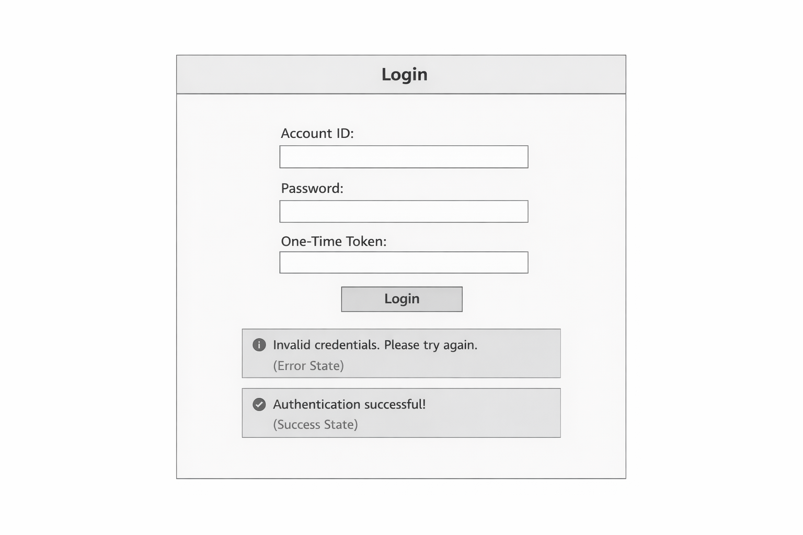
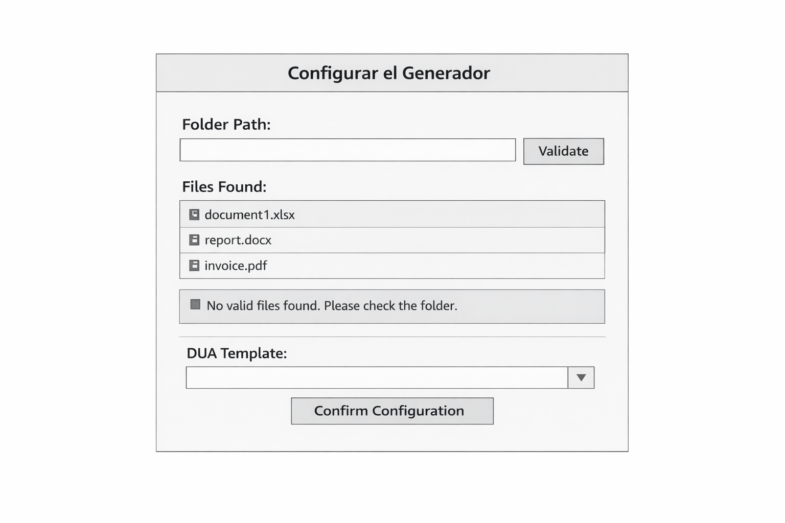
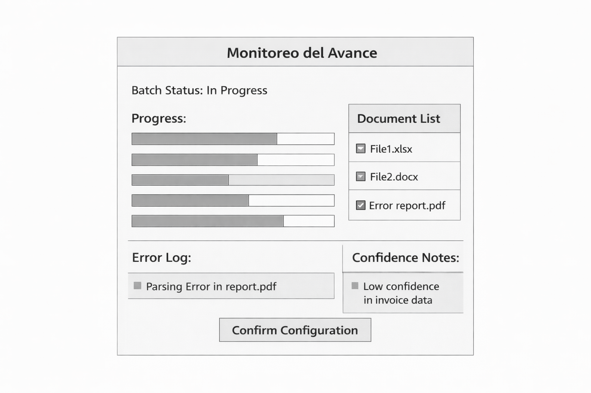
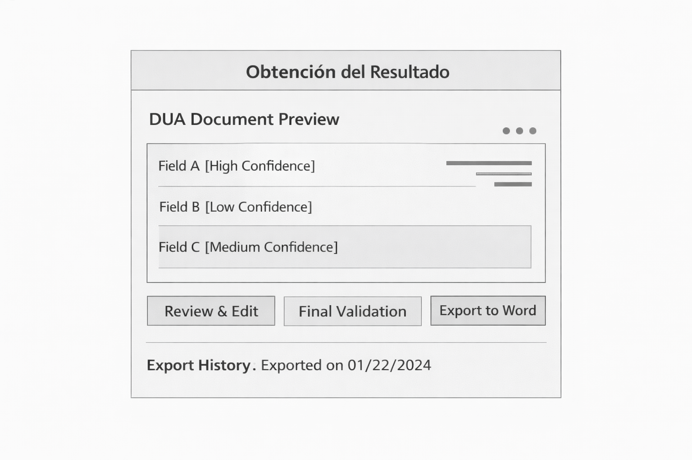
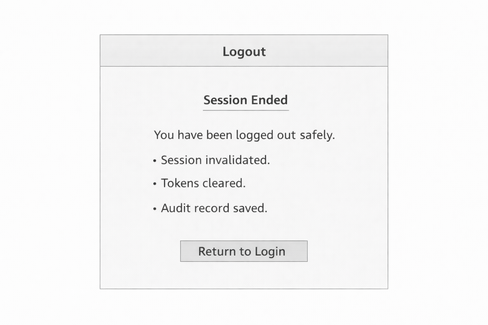

# DUA Streamliner

**Authors:** Jose Isaac Corrales Cascante - David Lopez Murillo

**Problem Statement:**
Preparing the Documento Único Aduanero (DUA) in Costa Rica is still a manual, time-consuming, and error-prone process for importers and exporters. The required information is distributed across heterogeneous source files such as Excel, Word, PDF, and scanned images, usually with different structures per supplier or company. Because of this variability, customs specialists must spend significant effort consolidating, interpreting, validating, and transcribing data into the official DUA format, increasing the risk of inconsistencies, omissions, delays, penalties, or rejection by customs authorities.

**Proposed Solution:**
DUA Streamliner proposes an automated workflow where the user provides only a folder path containing source documents (.xlsx, .docx, .pdf, and scanned images). The system performs multi-format reading, OCR, and AI-driven semantic extraction adapted to customs terminology, then maps detected data to the official DUA template defined by the Ministerio de Hacienda. It applies basic consistency checks (for example, totals, currency coherence, and date consistency), assigns confidence levels, and flags ambiguous fields for mandatory expert review. The output is a pre-filled DUA Word document with visual confidence indicators, designed to reduce repetitive manual work while keeping the customs specialist as the final decision-maker for validation and compliance.

# 1. Frontend Design

## 1.1 Technology stack:
### Frontend technology, security, third-party libraries, frameworks, and hosting; all with their respective versions.

- Aplication Type: Web App
- Web Framework: Angular v21.0.0
- Web Server: IIS 10 (Azure App Service Windows)
- TypeScript v5.9.3
- NodeJS v22
- ESLint v9.5.0
- Prettier v3.3.3
- SonarCloud v5.0.1
- Azure Application Insights SDK v3.3.1
- Unit Testing: Jest 30.2.0
- Data Validation Framework: Angular Reactive Forms Validators + Zod v3.23.8
- Integration Testing: Playwright v1.58.2
- Cloud Service: Azure Cloud Service
- Hosted By: Microsoft Azure - Azure App Service
- Code Repositories: Azure DevOps
- Code Automation Task Tool: npm scripts (NodeJS v22)
- CI/CD Pipelines Technology: Azure DevOps Pipelines (YAML)
- Environments: dev, staging, production
- Environment Deployments Tools: Azure DevOps Pipelines - Azure App Service Deploy task

## 1.2 UX UI analysis:

### Core business process
Describe step by step what happens on each screen in terms of actions (do not mention buttons, lists, or any visual components; only user actions and the result of each action).

#### Login
1. The user enters their account identifier and password.
2. The system validates that the data has the correct format and that required fields are not missing.
3. The user enters the one-time token to complete two-factor authentication.
4. If the credentials or the token are invalid, the system rejects the attempt and shows an invalid authentication message.
5. If the authentication is valid, the system creates the user session and applies permissions according to the assigned role.
6. The user is redirected to the generator configuration screen to begin the loading process.

#### Configure the generator
1. The user specifies the path to the folder that contains the source documents for the case.
2. The system verifies that the path exists and that it is accessible for reading.
3. The system identifies and lists compatible files found in the folder (Excel, Word, PDF, and scanned images).
4. If no valid files are detected, the system notifies the situation and asks the user to correct the path or add documents.
5. The user selects the official DUA template that will be used for the pre-filling process.
6. The system validates that the selected template corresponds to a supported format and that it is intact.
7. The user confirms the process configuration with the input folder and the destination template.
8. The system saves the configuration, prepares the document batch, and enables the start of the automated generation.

#### Monitoring progress
1. The user starts the automated generation and accesses the process monitoring screen.
2. The system records the start of the batch and changes its status to in progress.
3. The system continuously updates the progress by stage (reading, OCR, semantic extraction, mapping, and basic validations).
4. The user checks the overall batch progress and the individual status of each processed document.
5. If inconsistencies or low confidence are detected, the system marks observations for review without stopping the overall processing.
6. If an error occurs in a document, the system records the cause and maintains traceability to allow correction and retry.
7. When the process finishes, the system changes the status to completed or completed with observations and enables the final review stage.

#### Result retrieval / export
1. The user accesses the batch results once the process finishes.
2. The system presents the pre-filled DUA together with the fields marked by confidence level.
3. The user reviews and corrects the observed fields before approving the final document.
4. The system performs a final basic coherence validation on the consolidated data.
5. If the final validation is successful, the user exports the DUA in Word format (.docx).
6. The system records the export and preserves the process history for auditing and traceability.

#### Logout
1. The user decides to close the session after finishing the review or export.
2. The system invalidates the active session and removes temporary authentication tokens.
3. The system records the logout event in the audit log.
4. The user is redirected to the authentication flow for a new access.

### Wireframes
#### Screen 1 - Login
**Purpose:** Allow the user to securely authenticate with credentials and a one-time token to enable access to the system.

**Prompt:**
```text
Design a low-fidelity wireframe of a desktop web screen (1440x900) for DUA Streamliner. Monochromatic style, clean, without final branding. Show authentication flow with account identifier input, password, and OTP token, including validation of required fields, error state for invalid authentication, and successful state that redirects to Configure the generator. Wireframe only, not a realistic mockup.
```
**Image:**  


#### Screen 2 - Configure the generator
**Purpose:** Allow the user to define the input folder and the official DUA template before starting the processing.

**Prompt:**
```text
Create a low-fidelity desktop wireframe (1440x900) for the Configure the generator screen of DUA Streamliner. Show flow to enter folder path, validate access, detect and list compatible files (Excel, Word, PDF, and images), handle case with no valid files, select official DUA template, validate template integrity, and confirm configuration to start automated generation. Grayscale style, clear UX, wireframe only.
```
**Image:**  


#### Screen 3 - Progress monitoring
**Purpose:** Allow real-time tracking of the document batch, with visibility of progress, errors, and observations.

**Prompt:**
```text
Generate a low-fidelity desktop wireframe (1440x900) for the Progress monitoring screen of DUA Streamliner. Include overall batch status, progress by stages (reading, OCR, semantic extraction, mapping, and validations), status per document, error log with causes, and observations due to low confidence, showing final states completed or completed with observations. Focus on traceability and process control. Wireframe only.
```
**Image:**  


#### Screen 4 - Getting the result / export
**Purpose:** Allow final review of the pre-filled DUA, validation of flagged fields, and document export.

**Prompt:**
```text
Design a low-fidelity desktop wireframe (1440x900) for the Getting the result / export screen of DUA Streamliner. Show the pre-filled DUA, fields marked by confidence level, review and correction flow for observations, final coherence validation, and action to export to Word (.docx), including export logging for auditing. Monochromatic style, clear, and task-oriented. Wireframe only.
```
**Image:**  


#### Screen 5 - Logout
**Purpose:** Securely close the session, leave an audit trail, and redirect to the authentication flow.

**Prompt:**
```text
Create a low-fidelity desktop wireframe (1440x900) for the Logout flow of DUA Streamliner. Show logout confirmation, invalidation of active session, clearing of temporary tokens, audit log registry, and redirection to the authentication flow. Must communicate security and correct closure of the process. Wireframe only.
```
**Image:**  


## 1.3 Component design strategy:
### Defines the technique and principles for frontend component design, how component reusability is achieved, how styles are centralised, and how branding, internationalisation, and responsiveness are implemented.

## 1.4 Security:
### Technologies, techniques, and classes - along with their respective locations in the project structure - responsible for authentication, authorisation, permissions, and session management.

## 1.5 Layered design:
### Design and explanation of the different layers of the frontend application.

## 1.6  Design patterns:
### Class design and their respective locations in the project structure where object-oriented design patterns are applied, such as: security, UI refresh, notification handling, state storage, API calls, asynchronous operations, session invalidation, event-driven programming, and object creation.
