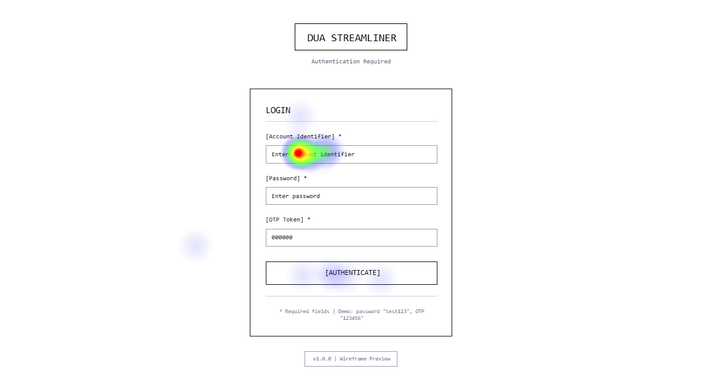

# DUA Streamliner

**Authors:** Jose Isaac Corrales Cascante - David Lopez Murillo

**Problem Statement:**
Preparing the Documento Único Aduanero (DUA) in Costa Rica is still a manual, time-consuming, and error-prone process for importers and exporters. The required information is distributed across heterogeneous source files such as Excel, Word, PDF, and scanned images, usually with different structures per supplier or company. Because of this variability, customs specialists must spend significant effort consolidating, interpreting, validating, and transcribing data into the official DUA format, increasing the risk of inconsistencies, omissions, delays, penalties, or rejection by customs authorities.

**Proposed Solution:**
DUA Streamliner proposes an automated workflow where the user provides only a folder path containing source documents (.xlsx, .docx, .pdf, and scanned images). The system performs multi-format reading, OCR, and AI-driven semantic extraction adapted to customs terminology, then maps detected data to the official DUA template defined by the Ministerio de Hacienda. It applies basic consistency checks (for example, totals, currency coherence, and date consistency), assigns confidence levels, and flags ambiguous fields for mandatory expert review. The output is a pre-filled DUA Word document with visual confidence indicators, designed to reduce repetitive manual work while keeping the customs specialist as the final decision-maker for validation and compliance.

# 1. Frontend Design

## 1.1 Technology stack:
### Frontend technology, security, third-party libraries, frameworks, and hosting; all with their respective versions.

- Aplication Type: Web App
- Web Framework: Angular v21.0.0
- Web Server: IIS 10 (Azure App Service Windows)
- TypeScript v5.9.3
- NodeJS v22
- ESLint v9.5.0
- Prettier v3.3.3
- SonarCloud v5.0.1
- Azure Application Insights SDK v3.3.1
- Unit Testing: Jest 30.2.0
- Data Validation Framework: Angular Reactive Forms Validators + Zod v3.23.8
- Integration Testing: Playwright v1.58.2
- Cloud Service: Azure Cloud Service
- Hosted By: Microsoft Azure - Azure App Service
- Code Repositories: Azure DevOps
- Code Automation Task Tool: npm scripts (NodeJS v22)
- CI/CD Pipelines Technology: Azure DevOps Pipelines (YAML)
- Environments: dev, staging, production
- Environment Deployments Tools: Azure DevOps Pipelines - Azure App Service Deploy task

## 1.2 UX UI analysis:

### Usability attributes

| Attribute | Target |
|-----------|--------|
| Learnability | First-time task completion without training — linear 4-screen workflow with one primary action per screen |
| Efficiency | DUA generation initiated in ≤ 3 interactions: folder path → template select → confirm |
| Error prevention | Inline validation before batch submission: path existence and template integrity verified before processing starts |
| Visibility of system status | Live per-stage and per-document progress visible during the entire batch |
| Confidence feedback | Green / Yellow / Red indicators on every DUA field communicate extraction certainty |
| Consistency | Uniform design tokens (color, spacing, typography) across all 4 feature modules via `tailwind.config.js` |
| Error recovery | Per-document retry without restarting the full batch; error log shows cause per document |
| Accessibility | WCAG 2.1 AA — sufficient contrast, full keyboard navigation, ARIA labels on all interactive elements |

### Core business process
Describe step by step what happens on each screen in terms of actions (do not mention buttons, lists, or any visual components; only user actions and the result of each action).

#### Login
1. The user enters their account identifier and password.
2. The system validates that the data has the correct format and that required fields are not missing.
3. The user enters the one-time token to complete two-factor authentication.
4. If the credentials or the token are invalid, the system rejects the attempt and shows an invalid authentication message.
5. If the authentication is valid, the system creates the user session and applies permissions according to the assigned role.
6. The user is redirected to the generator configuration screen to begin the loading process.

#### Configure the generator
1. The user specifies the path to the folder that contains the source documents for the case.
2. The system verifies that the path exists and that it is accessible for reading.
3. The system identifies and lists compatible files found in the folder (Excel, Word, PDF, and scanned images).
4. If no valid files are detected, the system notifies the situation and asks the user to correct the path or add documents.
5. The user selects the official DUA template that will be used for the pre-filling process.
6. The system validates that the selected template corresponds to a supported format and that it is intact.
7. The user confirms the process configuration with the input folder and the destination template.
8. The system saves the configuration, prepares the document batch, and enables the start of the automated generation.

#### Monitoring progress
1. The user starts the automated generation and accesses the process monitoring screen.
2. The system records the start of the batch and changes its status to in progress.
3. The system continuously updates the progress by stage (reading, OCR, semantic extraction, mapping, and basic validations).
4. The user checks the overall batch progress and the individual status of each processed document.
5. If inconsistencies or low confidence are detected, the system marks observations for review without stopping the overall processing.
6. If an error occurs in a document, the system records the cause and maintains traceability to allow correction and retry.
7. When the process finishes, the system changes the status to completed or completed with observations and enables the final review stage.

#### Result retrieval / export
1. The user accesses the batch results once the process finishes.
2. The system presents the pre-filled DUA together with the fields marked by confidence level.
3. The user reviews and corrects the observed fields before approving the final document.
4. The system performs a final basic coherence validation on the consolidated data.
5. If the final validation is successful, the user exports the DUA in Word format (.docx).
6. The system records the export and preserves the process history for auditing and traceability.

#### Logout
1. The user decides to close the session after finishing the review or export.
2. The system invalidates the active session and removes temporary authentication tokens.
3. The system records the logout event in the audit log.
4. The user is redirected to the authentication flow for a new access.

### Wireframes
#### Screen 1 - Login
**Purpose:** Allow the user to securely authenticate with credentials and a one-time token to enable access to the system.

**Prompt:**
```text
Design a low-fidelity wireframe of a desktop web screen (1440x900) for DUA Streamliner. Monochromatic style, clean, without final branding. Show authentication flow with account identifier input, password, and OTP token, including validation of required fields, error state for invalid authentication, and successful state that redirects to Configure the generator. Wireframe only, not a realistic mockup.
```
**Image:**


#### Screen 2 - Configure the generator
**Purpose:** Allow the user to define the input folder and the official DUA template before starting the processing.

**Prompt:**
```text
Create a low-fidelity desktop wireframe (1440x900) for the Configure the generator screen of DUA Streamliner. Show flow to enter folder path, validate access, detect and list compatible files (Excel, Word, PDF, and images), handle case with no valid files, select official DUA template, validate template integrity, and confirm configuration to start automated generation. Grayscale style, clear UX, wireframe only.
```
**Image:**


#### Screen 3 - Progress monitoring
**Purpose:** Allow real-time tracking of the document batch, with visibility of progress, errors, and observations.

**Prompt:**
```text
Generate a low-fidelity desktop wireframe (1440x900) for the Progress monitoring screen of DUA Streamliner. Include overall batch status, progress by stages (reading, OCR, semantic extraction, mapping, and validations), status per document, error log with causes, and observations due to low confidence, showing final states completed or completed with observations. Focus on traceability and process control. Wireframe only.
```
**Image:**


#### Screen 4 - Getting the result / export
**Purpose:** Allow final review of the pre-filled DUA, validation of flagged fields, and document export.

**Prompt:**
```text
Design a low-fidelity desktop wireframe (1440x900) for the Getting the result / export screen of DUA Streamliner. Show the pre-filled DUA, fields marked by confidence level, review and correction flow for observations, final coherence validation, and action to export to Word (.docx), including export logging for auditing. Monochromatic style, clear, and task-oriented. Wireframe only.
```
**Image:**


#### Screen 5 - Logout
**Purpose:** Securely close the session, leave an audit trail, and redirect to the authentication flow.

**Prompt:**
```text
Create a low-fidelity desktop wireframe (1440x900) for the Logout flow of DUA Streamliner. Show logout confirmation, invalidation of active session, clearing of temporary tokens, audit log registry, and redirection to the authentication flow. Must communicate security and correct closure of the process. Wireframe only.
```
**Image:**


### UX test results:

**Platform Used:** Maze | User Research and Testing Platform

**Results:**
| Participant | Outcome | Duration | Responded at          |
|-------------|---------|----------|-----------------------|
| 510669335   | Success | 16.04s   | 12 Mar 2026, 11:53 am |
| 510665402   | Success | 60.32s   | 12 Mar 2026, 11:46 am |
| 510665363   | Success | 108.55s  | 12 Mar 2026, 11:43 am |

**Heatmaps:**




## 1.3 Component design strategy:

### Strategy Name: Tailwind CSS (Utility-First Component Design Strategy)

### Reutilisation by
- **Utility-first CSS classes** that enable building reusable UI elements through composition of small, single-purpose classes (e.g., `flex`, `grid`, `p-4`, `text-sm`).
- **Angular component abstraction**, where reusable UI components such as buttons, cards, form fields, and layouts encapsulate Tailwind class combinations.
- **Shared component libraries** organised within a shared Angular module or folder structure (e.g., `/shared/components`) to promote reuse across the application.
- **Design tokens defined in `tailwind.config.js`**, allowing centralised configuration of colours, typography, spacing, and breakpoints that can be reused consistently across components.
- **`@apply` directive** in CSS to group commonly used Tailwind utility classes into reusable custom classes when needed.
- **Feature modules with Smart/Dumb component pattern** to structure reusable UI components: Smart components manage data and state, Dumb components handle only presentation via `@Input()`/`@Output()`, promoting testability and reuse across features.

### Internationalisation by
- **Angular built-in internationalisation (i18n)** framework to manage translations and localisation.
- **Translation files** (e.g., XLIFF or JSON) that store language resources for multiple locales.
- **Angular pipes** such as `date`, `currency`, and `number` to handle locale-specific formatting.
- **Language switching mechanisms** implemented through Angular services to dynamically change the application language.
- Tailwind CSS does not provide native internationalisation features but integrates seamlessly with Angular’s i18n system.

### Responsiveness by
- **Mobile-first responsive design approach**, where base styles target mobile devices and progressively adapt to larger screens.
- **Responsive utility modifiers** (`sm`, `md`, `lg`, `xl`, `2xl`) to apply styles at different viewport sizes.
- **Flexible layout utilities** such as `flex`, `grid`, `gap`, and `container` to create adaptable layouts.
- **Custom breakpoints defined in `tailwind.config.js`** to align with project-specific responsive requirements.
- **Responsive spacing and typography utilities** to ensure visual consistency across multiple device types and screen sizes.

## 1.4 Security:

**Authentication**:
- Provider: Azure Entra ID (formerly Azure Active Directory)
- Authentication Type: Multi-Factor Authentication (MFA)
- MFA Method: Mobile Authenticator Application only
- Single Sign-On: Enabled through Azure Entra ID

**Flow integration with frontend:**
- During login, the user is redirected to Azure Entra ID.
- Azure validates credentials and enforces MFA via mobile authenticator.
- Upon successful authentication, a secure token (JWT) is issued.
- The frontend consumes this token and establishes the user session.

**Authorisation (Role-Based Access Control - RBAC)**
Authorisation is managed through roles assigned via Azure Entra ID and interpreted within the application.

**Roles:**
- Manager
- Customs Agent

**Permissions by Role:**

**Manager**
- MANAGE_USERS → Manage user CRUD operations
- VIEW_REPORTS → Access operational and performance reports
- EDIT_TEMPLATES → Modify available DUA templates

**Customs Agent**
- LOAD_FILES → Upload and configure source document folders
- GENERATE_DUA → Trigger AI-based DUA generation process
- DOWNLOAD_DUA → Download generated DUA documents

**Session Management**

- Session is based on Azure-issued JWT tokens.
- Tokens are securely stored in memory or browser storage (depending on implementation strategy).
- Automatic session expiration is enforced based on token lifetime
- Logout invalidates local session and triggers Azure logout.

**Secure Configuration & Secrets Management**

**Service Used:** Azure Key Vault

**Purpose:**
- Store environment variables
- Store API keys
- Store sensitive configuration data

Secrets are never hardcoded in the application. The backend retrieves them securely from Azure Key Vault at runtime.

**Backend Identity Server**

**Server Name**: 'customsidentityserver'

This server acts as the secure bridge between Azure Entra ID and the application services, handling:

- Token validation
- Identity propagation
- Secure communication with backend services

**Additional Security Measures**

- HTTPS enforced across all environments
- Secure headers configured via Azure App Service
- Input validation using Angular Reactive Forms + Zod
- Audit logging for:
  - Login attempts
  - Logout events
  - DUA generation and export actions

### Classes and project locations

| Class | Path | Responsibility |
|-------|------|----------------|
| `AuthGuard` | `src/app/core/auth/auth.guard.ts` | Validates active JWT; redirects to login if expired |
| `RoleGuard` | `src/app/core/auth/role.guard.ts` | Validates user role permission per route |
| `AuthService` | `src/app/core/auth/auth.service.ts` | MSAL flow, token retrieval, session lifecycle |
| `AuthState` | `src/app/core/state/auth.state.ts` | Stores token, role, and expiration via Angular Signals |
| `AuthFacade` | `src/app/application/facades/auth.facade.ts` | Exposes `login()`, `logout()`, `getSession()` to components |
| `JwtInterceptor` | `src/app/core/interceptors/jwt.interceptor.ts` | Attaches Bearer token to every outgoing HTTP request |
| `ErrorInterceptor` | `src/app/core/interceptors/error.interceptor.ts` | 401 → session invalidation; 403 → access denied; 5xx → alert |
| `AuthApiClient` | `src/app/infrastructure/api-clients/auth-api.client.ts` | Azure Entra ID token refresh endpoint |

## 1.5 Layered design:
### Design and explanation of the different layers of the frontend application.

The frontend is a **Single Page Application (SPA)** built with Angular 21, deployed on Azure App Service.

**Why SPA over SSR or SSG:**
- The application is entirely private, accessible only after authentication through Azure Entra ID with MFA. There is no public content that requires search engine indexing or SEO optimisation, which eliminates the primary advantage of Server-Side Rendering.
- The core user workflows (real-time batch monitoring, DUA field editing with confidence indicators, inline corrections) demand continuous client-side interactivity. SPA handles this natively without requiring server round-trips for each UI update.
- The application maintains complex client-side state (user session, batch progress by stage, DUA field values, confidence levels, user corrections). SPA manages this state naturally in memory, avoiding the hydration complexity that SSR introduces.
- All users must complete the authentication flow before accessing any screen, so there is no benefit from SSR's faster first contentful paint for anonymous visitors.
- SSR would add infrastructure complexity (a Node.js server process, hydration handling, workarounds for browser-only APIs like `localStorage`) without delivering measurable benefits for this use case.

If there is no authenticated session, the **Authentication Layer** is invoked. This layer redirects the user to Azure Entra ID, handles the MFA flow via mobile authenticator, receives the JWT token upon success, and establishes the session. If authentication fails, the user remains on the login screen with an error notification. The Authentication Layer reads client IDs and tenant configuration from the **Settings Layer**.

Once authenticated, the user accesses the visual interface rendered by the **Components Layer**. Components are organised by **feature modules with a Smart/Dumb component pattern**. Each feature module (`login`, `configure-generator`, `progress-monitoring`, `result-export`) encapsulates its own components, routes, and dependencies. Within each feature, **Smart components** (also called containers) manage data flow, call facades, and hold state subscriptions, while **Dumb components** (also called presentational) receive data exclusively via `@Input()` and emit user actions via `@Output()`, containing no logic beyond rendering. Shared presentational components (buttons, confidence indicators, form fields, progress bars) styled with Tailwind CSS reside in a common shared module and are reused across features.

Within components, a **Facades Layer** exists to connect visual component actions with the **Services Layer**. Facades expose simplified methods that components call (e.g., `startGeneration()`, `exportDua()`), hiding the orchestration of multiple services behind a single entry point. Components never call services directly.

The **Services Layer** contains the application's business operations: batch configuration, DUA generation orchestration, progress monitoring, coherence validation (totals, currency, dates), confidence level evaluation, and document export preparation. To perform their tasks, services may require access to the **Utils**, **ApiClients**, and **Settings** layers.

The **ApiClients Layer** contains all classes that communicate with external APIs: the backend processing API for DUA generation, the file validation API, and the Azure Entra ID token refresh endpoint. ApiClients reads API base URLs and keys from the **Settings Layer**. The Settings Layer accesses environment variables configured in Azure Key Vault during application initialization.

All ApiClient calls and returns use classes defined in the **Models Layer**, which represent DUA domain entities (`DuaDocument`, `DuaField`, `BatchJob`, `SourceFile`, `UserSession`) with their associated enumerations (`ConfidenceLevel`, `BatchStatus`, `ProcessingStage`, `FileType`, `UserRole`). All data entering and leaving ApiClients is validated by the **DataValidation Layer**, which uses Angular Reactive Forms Validators for user input and Zod schemas for API response validation, ensuring type safety at system boundaries.

All layers can access the **Models**, **Utils**, and **State Management** layers. The State Management Layer (implemented with Angular Signals) maintains the global application state: current user session, active batch status, stage-by-stage progress, DUA field values with confidence levels, and user corrections. Any layer can read state, but only Services and Facades may write to it.

The **NotificationService Layer** enables real-time communication between layers through an event-driven mechanism. Services subscribe to events such as `batchStageCompleted`, `lowConfidenceDetected`, `documentProcessingFailed`, and `exportReady`. The Progress Monitoring screen subscribes to batch progress events to update the UI in real time. Asynchronous API calls that involve long-running backend operations (DUA generation, OCR processing) are handled via polling with server-sent progress updates consumed through the NotificationService Layer.

The **Logs Layer** provides classes to register system events: login attempts, logout events, DUA generation triggers, export actions, and validation failures. Log entries are structured with timestamp, user ID, action type, and result status, then sent to Azure Application Insights via ApiClients for auditing and traceability as defined in section 1.4.

The **ExceptionHandling Layer** is a shared cross-cutting layer accessible by all other layers. It captures unhandled errors, HTTP failures (via Angular interceptors: `401` triggers session invalidation, `403` emits access denied, `5xx` triggers user alert), and domain validation errors. All caught exceptions are routed to the Logs Layer for registration and, when user-facing, to the NotificationService Layer to display error messages.

The **Interceptors Layer** is a shared cross-cutting layer that processes all outgoing HTTP requests and incoming responses. `JwtInterceptor` attaches the Azure-issued Bearer token to every API call. `ErrorInterceptor` catches HTTP error responses and delegates them to the ExceptionHandling Layer. Interceptors operate transparently to all other layers.

### Layer Access Rules

| Layer | Can access |
|-------|-----------|
| Components | Facades |
| Facades | Services, State Management |
| Services | ApiClients, Utils, Settings, Models, State Management, NotificationService |
| ApiClients | Settings, Models, DataValidation, Logs |
| DataValidation | Models |
| NotificationService | Models |
| Logs | ApiClients |
| ExceptionHandling | Logs, NotificationService |
| Interceptors | ExceptionHandling, Settings |
| Models, Utils, State Management | *(accessible by all layers)* |

### Layered Architecture Diagram

```
        +------------------------+
        |     User Browser       |
        +-----------+------------+
                    |
                    v
        +------------------------+
        |   Azure App Service    |
        |   Angular 21 SPA       |
        +-----------+------------+
                    |
          Authentication Layer
          (Azure Entra ID + MFA)
                    |
    +---------------+----------------+
    |        Components Layer        |
    |  Feature Modules               |
    |  Smart (Container) Components  |
    |  Dumb (Presentational) Comp.   |
    +---------------+----------------+
                    |
              Facades Layer
                    |
              Services Layer
                    |
    +---------------+----------------+
    |               |                |
  Utils        ApiClients        Settings
                    |                |
                    |         Azure Key Vault
                    |                |
                    +----+-----------+
                         |
                   External APIs
                  (Backend, Azure AD)

  +-------------------------------------------------+
  |          Cross-Cutting Layers                    |
  |                                                 |
  |  Models ---- DataValidation (Zod + Validators)  |
  |                                                 |
  |  State Management (Angular Signals)             |
  |                                                 |
  |  NotificationService (Event-Driven)             |
  |                                                 |
  |  Interceptors (JWT + Error Handling)            |
  |                                                 |
  |  ExceptionHandling ---- Logs (App Insights)     |
  +-------------------------------------------------+
```

## 1.6  Design patterns:
### Class design and their respective locations in the project structure where object-oriented design patterns are applied, such as: security, UI refresh, notification handling, state storage, API calls, asynchronous operations, session invalidation, event-driven programming, and object creation.

**Object Creation — Factory Pattern:** `DocumentProcessorFactory` (`src/app/core/services/document-processor.factory.ts`) receives a `FileType` enum (`XLSX`, `DOCX`, `PDF`, `IMAGE`) and returns the corresponding processor: `ExcelProcessor`, `WordProcessor`, `PdfProcessor`, `ImageOcrProcessor` (same folder). Centralises object creation and eliminates scattered conditional logic across services.

**Object Creation — Builder Pattern:** `DuaExportBuilder` (`src/app/core/services/dua-export.builder.ts`) constructs the final DUA export step by step: apply user corrections → coherence validation (totals, currency, dates) → attach confidence metadata → generate audit entry → produce `.docx` payload. Chainable steps adapt to clean or observation-flagged batches.

**API Calls — Adapter Pattern:** `DuaDocumentAdapter` (`src/app/infrastructure/adapters/dua-document.adapter.ts`) maps raw backend responses into `DuaDocument` with `DuaField[]` and `ConfidenceLevel` enums. `BatchJobAdapter` (`src/app/infrastructure/adapters/batch-job.adapter.ts`) converts progress polling responses into `BatchJob` with stage-by-stage breakdown. ApiClients never expose raw JSON to upper layers.

**Notification Handling / Event-Driven — Observer Pattern:** `NotificationService` (`src/app/core/notifications/notification.service.ts`) uses RxJS `Subject` and `BehaviorSubject` to publish events (`batchStageCompleted`, `lowConfidenceDetected`, `documentProcessingFailed`, `exportReady`). Any layer subscribes to receive them. Progress Monitoring smart component subscribes to `batchProgress$` for real-time UI updates.

**UI Refresh — Observer Pattern:** Smart components subscribe to `Observable` and `Signal` streams exposed by Facades. State changes propagate to Dumb components exclusively via `@Input()` bindings. Angular's change detection updates only affected components — no manual DOM manipulation.

**Asynchronous Operations — Observer Pattern with RxJS Operators:** All HTTP calls return `Observable` streams managed with `switchMap`, `catchError`, `retry`, and `takeUntil`. DUA generation uses `interval` + `switchMap` to poll batch progress. `takeUntil` automatically unsubscribes on navigation to prevent memory leaks.

**State Storage — Singleton Pattern with Signals:** `StateManagementService` (`src/app/core/state/`) registered `providedIn: 'root'` uses Angular Signals to hold `AuthState` (`auth.state.ts`), `BatchState` (`batch.state.ts`), and `DuaResultState` (`dua-result.state.ts`). Only Services and Facades write; components read reactively.

**Singleton Pattern:** All services requiring a single shared instance are registered with `providedIn: 'root'`: `ExceptionHandlingService` (`src/app/core/exception-handling/exception-handling.service.ts`), `NotificationService` (`src/app/core/notifications/notification.service.ts`), `LogService` (`src/app/core/logging/log.service.ts`), `DuaApiClient` (`src/app/infrastructure/api-clients/dua-api.client.ts`), `FileApiClient` (`src/app/infrastructure/api-clients/file-api.client.ts`), `AuthApiClient` (`src/app/infrastructure/api-clients/auth-api.client.ts`), `SettingsService` (`src/app/core/settings/settings.service.ts`), `StateManagementService`.

**Security / Session Invalidation — Chain of Responsibility Pattern:** `JwtInterceptor` (`src/app/core/interceptors/jwt.interceptor.ts`) runs first to attach the Azure Entra ID Bearer token. `ErrorInterceptor` (`src/app/core/interceptors/error.interceptor.ts`) handles responses: `401` → session invalidation + redirect to login; `403` → access-denied event via `NotificationService`; `5xx` → log + user alert. Each interceptor passes unhandled cases down the chain.

**Security — Guard Pattern (Template Method):** `AuthGuard` (`src/app/core/auth/auth.guard.ts`) validates the active session token and redirects to login if expired. `RoleGuard` (`src/app/core/auth/role.guard.ts`) extends the check to verify the user's role holds the required permission for the target route (e.g., `GENERATE_DUA` for `/generate`). Template: validate precondition → allow or deny → redirect if denied.

**Structural — Facade Pattern:** `DuaGenerationFacade` (`src/app/application/facades/dua-generation.facade.ts`) exposes `startGeneration()`, which orchestrates file validation, batch submission, progress subscription setup, and state initialisation. `AuthFacade` (`src/app/application/facades/auth.facade.ts`) and `BatchMonitoringFacade` (`src/app/application/facades/batch-monitoring.facade.ts`) follow the same principle. Smart components call one facade method instead of coordinating multiple services.

## 1.7 Project scaffold

Scaffold location: [`/src`](/src)

```
src/
├── main.ts
├── index.html
├── styles.css
├── environments/
│   ├── environment.ts
│   ├── environment.staging.ts
│   └── environment.prod.ts
├── assets/
│   └── i18n/
│       ├── en.json
│       └── es.json
└── app/
    ├── app.component.ts
    ├── app.config.ts
    ├── app.routes.ts
    ├── core/
    │   ├── auth/
    │   │   ├── auth.guard.ts
    │   │   ├── auth.service.ts
    │   │   └── role.guard.ts
    │   ├── data-validation/
    │   │   ├── batch.schema.ts
    │   │   └── dua.schema.ts
    │   ├── exception-handling/
    │   │   └── exception-handling.service.ts
    │   ├── interceptors/
    │   │   ├── error.interceptor.ts
    │   │   └── jwt.interceptor.ts
    │   ├── logging/
    │   │   └── log.service.ts
    │   ├── models/
    │   │   ├── batch-job.model.ts
    │   │   ├── batch-status.enum.ts
    │   │   ├── confidence-level.enum.ts
    │   │   ├── dua-document.model.ts
    │   │   ├── dua-field.model.ts
    │   │   ├── file-type.enum.ts
    │   │   ├── processing-stage.enum.ts
    │   │   ├── source-file.model.ts
    │   │   ├── user-role.enum.ts
    │   │   └── user-session.model.ts
    │   ├── notifications/
    │   │   └── notification.service.ts
    │   ├── services/
    │   │   ├── batch.service.ts
    │   │   ├── coherence-validation.service.ts
    │   │   ├── confidence-level.service.ts
    │   │   ├── document-processor.factory.ts
    │   │   ├── dua-export.builder.ts
    │   │   ├── excel.processor.ts
    │   │   ├── image-ocr.processor.ts
    │   │   ├── pdf.processor.ts
    │   │   └── word.processor.ts
    │   ├── settings/
    │   │   └── settings.service.ts
    │   ├── state/
    │   │   ├── auth.state.ts
    │   │   ├── batch.state.ts
    │   │   └── dua-result.state.ts
    │   └── utils/
    │       ├── currency.util.ts
    │       └── date.util.ts
    ├── application/
    │   └── facades/
    │       ├── auth.facade.ts
    │       ├── batch-monitoring.facade.ts
    │       └── dua-generation.facade.ts
    ├── infrastructure/
    │   ├── adapters/
    │   │   ├── batch-job.adapter.ts
    │   │   └── dua-document.adapter.ts
    │   └── api-clients/
    │       ├── auth-api.client.ts
    │       ├── dua-api.client.ts
    │       └── file-api.client.ts
    ├── features/
    │   ├── login/
    │   │   └── components/
    │   │       ├── login.component.ts
    │   │       └── login-form.component.ts
    │   ├── configure-generator/
    │   │   └── components/
    │   │       ├── configure-generator.component.ts
    │   │       ├── file-list.component.ts
    │   │       ├── folder-path-input.component.ts
    │   │       └── template-selector.component.ts
    │   ├── progress-monitoring/
    │   │   └── components/
    │   │       ├── document-status.component.ts
    │   │       ├── error-log.component.ts
    │   │       ├── progress-monitoring.component.ts
    │   │       └── stage-progress.component.ts
    │   └── result-export/
    │       └── components/
    │           ├── dua-preview.component.ts
    │           ├── export-actions.component.ts
    │           ├── field-editor.component.ts
    │           └── result-export.component.ts
    └── shared/
        └── components/
            ├── button/
            │   └── button.component.ts
            ├── confidence-indicator/
            │   └── confidence-indicator.component.ts
            ├── form-field/
            │   └── form-field.component.ts
            └── progress-bar/
                └── progress-bar.component.ts
```

Root config files: `angular.json`, `tailwind.config.js`, `tsconfig.json`, `package.json`
